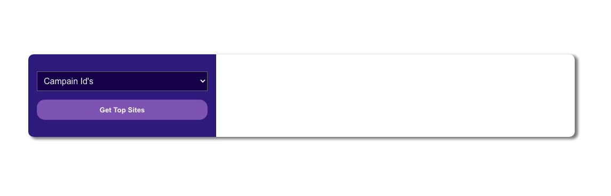
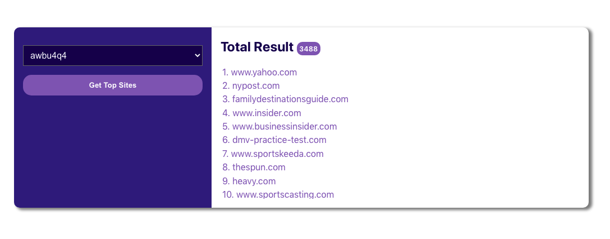

# Adludio - Challenge

This is Adludio Challenge, In this challenge I have tried to tackle the following tasks
- **Task - 1** : Filter out top scoring sites given CampaignId
- **Task - 2** : Develop Basic Web app with React Front-end and Flask-Backend
- **Task - 3** : Perform Feature importance with jupyter notebook using machine learning models

## Instalation GUIDE
- Clone the project to your local machine
    - `git clone https://github.com/NatnaelSisay/adludio-challenge.git`
    - `cd adludio-challenge`

- Create a new Virtual enviroment with python and Install all the required python dependencies
    - `python3 -m venv adlu-env`
    - `source adlu-env/bin/activate`
    - `pip install -r requirements.txt` 

- Install Node and React CLI

## Running Server and Client
Make sure to run on a diffrent terminals

- Running Server
    - `cd web/flask-server`
    - `flask run`

- Running Client
    - `cd web/adludio-front`
    - `npm install`
    - `npm start`

